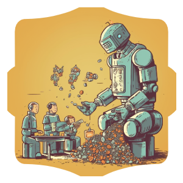

<div align="center">



# `Fundraise.sol`

_This project is unaudited. Please audit before deploying to mainnet._


---

</div>

**Motivation**

During memecoin season, a lot of projects hype their contribution address to a private EOA with no soft/hard caps and people "ape in". Management of these funds can be mismanaged and token distribution cannot be easily checked.

If a project does not go ahead (ie: meet their soft-cap) they rely on the meme coin creators to not rug and send back the ETH. 

What if there was a better way? We are working with programmable money after all!

### Features

* Deployer sets `min` and `max` contribution limits that are enforced!
* Deployer sets the soft-cap and hard-cap limits, these have enforced rules!
* Deployer cannot withdraw the ETH until they have met the soft-cap!
* Disallow contributions from exchanges!
* Users can withdraw their contributions (partial or full) until soft-cap is reached!

#### Soft-Cap

This is the amount of ETH to have raised _before_ the deployer/owner can withdraw anything. Before hitting the soft-cap, the contributors can withdraw a partial or their full contributions.

#### Hard-Cap

This is the amount of ETH the contract wants to raise and will not accept _any_ ETH after this has been hit.

### Offchain Indexer

When someone contributes to the fundraise or withdraws their ETH, an event is emitted. You can listen for this event.

```
event Contributed(
    address indexed sender,     # the address of the contributor
    bool indexed isDeposit,     # true if deposit, false is withdraw
    uint256 amount,             # the eth value of the transaction sent by the user
    uint256 totalAmount         # the total amount contributed by the user
);
```

### Interface

```
// cast interface <(cat ./out/Fundraise.sol/Fundraise.json | jq .abi)


interface Interface {
    event Contributed(address indexed sender, bool indexed isDeposit, uint256 amount, uint256 totalAmount);
    event Fundrasing(bool isOpen);

    function amountRaised() external view returns (uint256);
    function contribute() external payable;
    function contributions(address) external view returns (uint256);
    function contributionsOf(address _contributor) external view returns (uint256);
    function fundraiseHardCapWei() external view returns (uint256);
    function fundraiseSoftCapWei() external view returns (uint256);
    function maxContributionWei() external view returns (uint256);
    function minContributionWei() external view returns (uint256);
    function owner() external view returns (address);
    function ownerWithdraw() external;
    function totalRaised() external view returns (uint256);
    function userWithdraw(uint256 _amt) external;
}
```